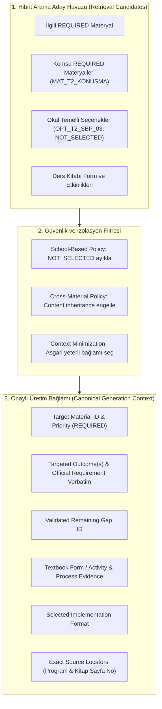

# Türkiye Yüzyılı Maarif Modeli (TYMM) TDE 9 Ölçme-Değerlendirme Tasarım Sözleşmesi Raporu (Assessment Design Contract Report)

**Ders / Sınıf:** Türk Dili ve Edebiyatı 9. Sınıf (`TDE_9`)  
**Tarih:** 14 Ağustos 2026  
**Aşama:** MATERIAL GENERATION / Assessment Design Contract Final Context Hardening (Final Freeze Öncesi)  
**Hedef Kapsam:** 7 REQUIRED Ölçme-Değerlendirme Materyali İçin Generation Context Bütünlüğü, Okul Temelli Seçenek İzolasyonu, Telif Enum Tutarlılığı, Barem Mimarisi ve Gate Doğrulaması  
**Sözleşme ID:** `TDE_9_ASSESSMENT_DESIGN_CONTRACT` (v1.2.0)  

---

## 1. Yönetici Özeti ve Nihai Doğrulama Kararı

9. sınıf Türk Dili ve Edebiyatı dersi kapsamında dondurulmuş kanonik bilgi tabanına (`curriculum_map.json`, `textbook_map.json`, `textbook_forms_index.json`, `production_manifest.json`, `consolidated_resource_plan.json`) dayalı olarak, üretim kuyruğundaki **7 adet REQUIRED ölçme-değerlendirme materyali** için hazırlanan **Ölçme-Değerlendirme Tasarım Sözleşmesi (Assessment Design Contract)**, Final Freeze öncesi hedeflenen 3 kritik eksende güçlendirilmiştir:

1. **Generation Context Completeness:** Resolver'ın yalnızca varlık sayısı (`resolved_entity_ids > 0`) üzerinden onay vermesi engellenmiş; her bir REQUIRED materyal için kazanım, resmî program hükmü, yapısal boşluk (gap), ders kitabı formu/etkinliği, ölçüt/süreç kanıtı, seçilen pedagojik araç ve kaynak locator'larının eksiksiz çözümlendiği (`generation_context_complete = true`) doğrulanmıştır.
2. **Okul Temelli Planlama Seçeneklerinin İzolasyonu:** `school_based_planning_options.json` içindeki `NOT_SELECTED` durumundaki pedagojik önerilerin (`OPT_T2_...`, `OPT_T3_...`, `OPT_T4_...`) semantik arama aday listesinde kalabileceği ancak canonical generation context içine asla sızamayacağı tescil edilmiştir (`unselected_school_based_options_in_generation_context = []`).
3. **Canonical Rights Enum Uyumu:** Sözleşme içindeki gayriresmî telif statüsü kaldırılmış; tüm kaynak hakları modeli doğrudan kanonik rights enum (`OFFICIAL_REUSE_ALLOWED`) ve operasyonel sayfa referanslama politikası (`PAGE_REFERENCE`, `long_text_embedding_allowed = false`) üzerine oturtulmuştur.

```text
========================================================================================
             ASSESSMENT DESIGN CONTRACT FINAL CONTEXT HARDENING ÖZETİ
========================================================================================
  ASSESSMENT_CONTRACT_FINAL_CONTEXT_HARDENING   : 🟢 PASS
  CONTRACT_ID                                   : TDE_9_ASSESSMENT_DESIGN_CONTRACT
  CONTRACT_VERSION                              : 1.2.0
  GENERATION_CONTEXT_COMPLETE                   : 🟢 7/7 PASS
  OUTCOME_CONTEXT                               : 🟢 7/7 PASS
  OFFICIAL_REQUIREMENT_CONTEXT                  : 🟢 7/7 PASS
  GAP_CONTEXT                                   : 🟢 7/7 PASS
  TEXTBOOK_CONTEXT                              : 🟢 7/7 PASS
  SOURCE_LOCATOR_COMPLETENESS                   : 🟢 7/7 PASS
  SCHOOL_BASED_CONTAMINATION                    : 🟢 PASS (0 Bulaşma)
  UNSELECTED_SCHOOL_BASED_OPTIONS_IN_CONTEXT    : 0 / 7
  CROSS_MATERIAL_CONTENT_CONTAMINATION          : 🟢 PASS (0 İçerik Kirlenmesi)
  RIGHTS_ENUM_CONSISTENCY                       : 🟢 PASS (Canonical Enum Uyumlu)
  RIGHTS_STATUS_USED                            : OFFICIAL_REUSE_ALLOWED
  RESOLVER_EVIDENCE                             : 🟢 7/7 PASS
  CONTRACT_QA                                   : 🟢 PASS (21/21 QA Denetimi Başarılı)
  MATERIAL_GENERATION_GATE                      : 🟢 OPEN
  Material generated                            : NONE
  Canonical knowledge changed                   : NONE
  RAG implementation changed                    : NO
  Index rebuilt                                 : NO
  Git commit                                    : NO
========================================================================================
```

---

## 2. Aday Listesi (Retrieval Candidates) vs. Onaylı Üretim Bağlamı (Canonical Generation Context)

Sözleşme kapsamında semantik/hibrit erişim adayları ile üretime girecek bağlam birbirinden kesin sınırlarla ayrılmıştır:



- **Retrieval Candidates:** FTS5, vektör ve RRF araması sırasında dönen ham aday listesidir.
- **Canonical Generation Context:** Yalnızca doğrulanmış ve yetkilendirilmiş varlıkların yer aldığı, downstream üretece aktarılacak asgari yeterli üretim bağlamıdır.

---

## 3. 7 REQUIRED Materyal İçin Gerçek Kanonik Zincirler (Exact Expected Chains)

7 REQUIRED materyalin her biri için kanonik bilgi tabanından çözümlenen eksiksiz zincirler:

### 1. `MAT_T2_KONUSMA_RUBRIC`
- **Materyal:** `MAT_T2_KONUSMA_RUBRIC` (Priority: `REQUIRED`)
- **Hedef Öğrenme Çıktısı:** `TEMA_02::TDE3.4` (Konuşma içeriğinin etkisini yansıtabilme)
- **Resmî Program Hükmü:** *"Öğretmen değerlendirmesi dereceli puanlama anahtarı ile gerçekleştirilir. Puanlama anahtarında ses ve diksiyon, akıcılık, beden dili, içeriğin kurgusallığı, zaman yönetimi, Türkçenin doğru kullanımı, etkileyicilik vb. ölçütler yer alır."* (`öğretim programı.pdf, s. 74, 75, 78`)
- **Doğrulanmış Boşluk:** `GAP_T2_K4` (Kitap s. 129'daki formun düzey betimleyicisiz ölçüt tablosu olması)
- **Ders Kitabı Formu:** `FORM_IN_T2_KONUSMA_CRITERIA` (`assessment_criteria_table`, s. 129 [PDF: 130])
- **Ders Kitabı Etkinlik Kanıtı:** `T2_ACT_08_KONUSMA_SIRASI`, `T2_ACT_09_KONUSMA_SONRASI` (Karakterimin Yolculuğu / Şiir Dinletisi)
- **Seçilen Uygulama:** `analytic_rubric`
- **Generation Context Durumu:** `generation_context_complete = true`

### 2. `MAT_T2_YAZMA_RUBRIC`
- **Materyal:** `MAT_T2_YAZMA_RUBRIC` (Priority: `REQUIRED`)
- **Hedef Öğrenme Çıktısı:** `TEMA_02::TDE4.4` (Yazma değerlendirmelerini yansıtabilme)
- **Resmî Program Hükmü:** *"Performans görevi; tema, ana duygu, ritim ve ahenk ögeleri, söz varlığının bağlama uygun kullanımı vb. ölçütlerin yer aldığı bir puanlama anahtarı ile puanlanır. Öğretmen değerlendirmesi dereceli puanlama anahtarı ile gerçekleştirilir."* (`öğretim programı.pdf, s. 74, 75, 79`)
- **Doğrulanmış Boşluk:** `GAP_T2_Y4` (Kitap s. 141'deki formun düzey betimleyicisiz ölçüt tablosu olması)
- **Ders Kitabı Formu:** `FORM_IN_T2_YAZMA_CRITERIA` (`assessment_criteria_table`, s. 141 [PDF: 142])
- **Ders Kitabı Etkinlik Kanıtı:** `T2_ACT_12_YAZMA_SIRASI`, `T2_ACT_13_YAZMA_SONRASI` (Ben Şair Olsaydım Şiir Yazma Görevi)
- **Seçilen Uygulama:** `analytic_rubric`
- **Generation Context Durumu:** `generation_context_complete = true`

### 3. `MAT_T3_KONUSMA_RUBRIC`
- **Materyal:** `MAT_T3_KONUSMA_RUBRIC` (Priority: `REQUIRED`)
- **Hedef Öğrenme Çıktısı:** `TEMA_03::TDE3.4` (Konuşma yansıtması)
- **Resmî Program Hükmü:** *"Sunumlar, dereceli puanlama anahtarı ile puanlanır. Puanlama içerik, anlatım, organizasyon ve iletişim vb. ölçütler bağlamında değerlendirilir."* (`öğretim programı.pdf, s. 81, 82, 86`)
- **Doğrulanmış Boşluk:** `TDE9_T3_K4` (Kitap s. 195'teki formun düzey betimleyicisi barındırmaması)
- **Ders Kitabı Formu:** `FORM_IN_T3_KONUSMA_CRITERIA` (`assessment_criteria_table`, s. 195 [PDF: 196])
- **Ders Kitabı Etkinlik Kanıtı:** `T3_ACT_08_KONUSMA_SIRASI`, `T3_ACT_09_KONUSMA_SONRASI` (Benim Mekânım Sunumu)
- **Seçilen Uygulama:** `analytic_rubric`
- **Generation Context Durumu:** `generation_context_complete = true`

### 4. `MAT_T3_YAZMA_RUBRIC`
- **Materyal:** `MAT_T3_YAZMA_RUBRIC` (Priority: `REQUIRED`)
- **Hedef Öğrenme Çıktısı:** `TEMA_03::TDE4.4` (Yazma yansıtması)
- **Resmî Program Hükmü:** *"Öğrencinin yazılı ürünleri dereceli puanlama anahtarı ile puanlanır... Puanlama anahtarında anlam, dilin ve görsel ögelerin kullanımı, özgünlük, tutarlılık, doğruluk, yazım ve noktalama gibi ölçütler yer alabilir."* (`öğretim programı.pdf, s. 81, 82, 88`)
- **Doğrulanmış Boşluk:** `TDE9_T3_Y4` (Kitap s. 205'teki infografik formunun rubrik yapısında olmaması)
- **Ders Kitabı Formu:** `FORM_IN_T3_YAZMA_CRITERIA` (`assessment_criteria_table`, s. 205 [PDF: 206])
- **Ders Kitabı Etkinlik Kanıtı:** `T3_ACT_12_YAZMA_SIRASI`, `T3_ACT_13_YAZMA_SONRASI` (Nevruz Belgeseli İnfografik Metin Yazımı)
- **Seçilen Uygulama:** `analytic_rubric`
- **Generation Context Durumu:** `generation_context_complete = true`

### 5. `MAT_T4_KONUSMA_RUBRIC`
- **Materyal:** `MAT_T4_KONUSMA_RUBRIC` (Priority: `REQUIRED`)
- **Hedef Öğrenme Çıktıları:** `TEMA_04::TDE3.2` + `TDE3.3` (Konuşma içeriği oluşturma ve kural uygulama)
- **Resmî Program Hükmü:** *"Sunum performansı, dereceli puanlama anahtarı ile puanlanır. Puanlama anahtarında içeriğe uygunluk, özgünlük, sunum becerisi, görsel ögeleri kullanma, zaman ve mekân kullanımı, beden dili ile jest ve mimik kullanımı gibi ölçütler yer alır."* (`öğretim programı.pdf, s. 90, 91, 95`)
- **Doğrulanmış Boşluk:** `TDE9_T4_K2_K3_SHARED` (Ortak konuşma puanlama boşluğu; s. 279'daki formun düzey betimleyicisiz olması)
- **Ders Kitabı Formu:** `FORM_IN_T4_KONUSMA_CRITERIA` (`assessment_criteria_table`, s. 279 [PDF: 280])
- **Ders Kitabı Etkinlik Kanıtı:** `T4_ACT_08_KONUSMA_SIRASI`, `T4_ACT_09_KONUSMA_SONRASI` (Dilimizin Zenginlikleri Sunumu)
- **Seçilen Uygulama:** `analytic_rubric`
- **Generation Context Durumu:** `generation_context_complete = true`

### 6. `MAT_T4_YAZMA_KONTROL_LISTESI`
- **Materyal:** `MAT_T4_YAZMA_KONTROL_LISTESI` (Priority: `REQUIRED`)
- **Hedef Öğrenme Çıktısı:** `TEMA_04::TDE4.1` (Yazma sürecini yönetebilme)
- **Resmî Program Hükmü:** *"Yazma sürecinin tüm aşamalarının başarılı bir şekilde uygulanabilmesi için kontrol listesi hazırlanır."* (`öğretim programı.pdf, s. 90, 91, 96`)
- **Doğrulanmış Boşluk:** `TDE9_T4_Y1` (Yazma sürecine ait ikili kontrol listesi açığı; kitapta bulunmaması)
- **Ders Kitabı Karşılığı:** Kitapta form yoktur (`textbook_forms = []`); program açığını doğrudan kapatır (`FILLS_PROGRAM_GAP`).
- **Ders Kitabı Süreç Kanıtı:** `T4_SEC_05_YAZMA_ATOLYESI`, `T4_ACT_12_YAZMA_SIRASI`, `T4_ACT_13_YAZMA_SONRASI` (Otobiyografi Yazma Atölyesi 5 Aşamalı Süreç Adımları)
- **Seçilen Uygulama:** `checklist`
- **Generation Context Durumu:** `generation_context_complete = true`

### 7. `MAT_T4_YAZMA_RUBRIC`
- **Materyal:** `MAT_T4_YAZMA_RUBRIC` (Priority: `REQUIRED`)
- **Hedef Öğrenme Çıktıları:** `TEMA_04::TDE4.2` + `TDE4.3` (Yazı içeriği oluşturma ve kural uygulama)
- **Resmî Program Hükmü:** *"Değerlendirmede dereceli puanlama anahtarı kullanılır. Puanlama anahtarında yazılı anlatımlar; bağlama uygunluk, dil ve anlatım özelliği, etkileyicilik, gerçeklik, tutarlılık, özgünlük gibi ölçütler bağlamında değerlendirilir."* (`öğretim programı.pdf, s. 90, 91, 96`)
- **Doğrulanmış Boşluk:** `TDE9_T4_Y2_Y3_SHARED` (Ortak otobiyografi puanlama boşluğu; s. 294'teki formun düzey betimleyicisiz olması)
- **Ders Kitabı Formu:** `FORM_IN_T4_YAZMA_CRITERIA` (`assessment_criteria_table`, s. 294 [PDF: 295])
- **Ders Kitabı Etkinlik Kanıtı:** `T4_ACT_12_YAZMA_SIRASI`, `T4_ACT_13_YAZMA_SONRASI` (Otobiyografimle Keşfedilmeyi Bekliyorum!)
- **Seçilen Uygulama:** `analytic_rubric`
- **Generation Context Durumu:** `generation_context_complete = true`

---

## 4. İzolasyon ve Kirlenme Önleme Politikaları

### A. Okul Temelli Planlama İzolasyon Politikası (`SCHOOL_BASED_CONTEXT_POLICY`)
- `school_based_planning_options.json` içindeki kayıtlar varsayılan olarak `selection_status = "NOT_SELECTED"` ve `generation_status = "NOT_REQUESTED"` durumundadır.
- Bu seçenekler (`OPT_T2_...`, `OPT_T3_...`, `OPT_T4_...`) semantik arama sırasında aday listesinde görünebilir; ancak **onaylı üretim bağlamına (generation context) kesinlikle giremez**.
- 7 REQUIRED materyalin tamamında:  
  `unselected_school_based_options_in_generation_context = []` doğrulanmıştır (0 bulaşma).

### B. Çapraz Materyal İçerik İzolasyonu (`CROSS_MATERIAL_CONTENT_POLICY`)
- Semantik arama sırasında komşu materyaller (örn. `MAT_T2_YAZMA_RUBRIC` sorgusunda `MAT_T2_KONUSMA_RUBRIC`) aday listesinde belirebilir.
- Bu bir bilgi çelişkisi değildir; ancak sözleşme düzeyinde materyaller arasında **yalnızca yapısal şablon paylaşımı (structural template sharing)** yapılır, **asla içerik miras alma (content inheritance)** yapılmaz.
- 7 REQUIRED materyalin tamamında:  
  `cross_material_content_dependencies_in_generation_context = []` doğrulanmıştır (0 kirlenme).

---

## 5. Telif Hakları Modeli ve Canonical Enum Uyumu

- **Kanonik Rights Enum:** `PUBLIC_DOMAIN`, `OPEN_LICENSE`, `OFFICIAL_REUSE_ALLOWED`, `LIMITED_QUOTATION`, `LINK_ONLY`, `UNKNOWN_RIGHTS`, `DO_NOT_USE`.
- **Kullanılan Hak Durumu:** Resmî MEB öğretim programı ve onaylı devlet ders kitabı kaynakları için `source_rights_status = "OFFICIAL_REUSE_ALLOWED"` olarak tescil edilmiştir.
- **Kullanım Modeli:** `embed_mode = "PAGE_REFERENCE"`, `long_text_embedding_allowed = false`, `locator_only_for_long_source_content = true`.
- **Telif Disiplini:** Ders kitabında veya edebî metinlerde yer alan telifli uzun şiir, metin ve hikâyeler materyal içerisine gömülmez; yalnızca sayfa/bölüm locator referansı verilir.

---

## 6. Kalite Güvencesi (QA) Denetim Tablosu (21 Boyut)

| No | QA Denetim Başlığı | Sonuç | Doğrulama Bulgusu ve Gerekçe |
| :---: | :--- | :---: | :--- |
| 1 | **OFFICIAL_VS_IMPLEMENTATION_QA** | **PASS** | Resmî programdaki verbatim ifadeler ile seçilen pedagojik araç adları kesin çizgilerle ayrılmıştır. |
| 2 | **CRITERION_PROVENANCE_QA** | **PASS** | 3 kademeli kaynak hiyerarşisi korunmuş; programdaki "vb." ifadesinin resmî kriter uydurmaya alet edilmesi engellenmiştir. |
| 3 | **PROVENANCE_SCHEMA_CONSISTENCY_QA** | **PASS** | Tüm ölçüt kayıtları canonical origin_enum (official_curriculum, official_textbook, pedagogical_recommendation) ile tam uyumludur. |
| 4 | **TEXTBOOK_PRESERVATION_QA** | **PASS** | Ders kitabı ve programdaki mevcut ölçüt adları tahrif edilmeden korunmuştur. |
| 5 | **DESCRIPTOR_STANDARD_QA** | **PASS** | Gözlenebilir eyleme dayalı, komşu düzeylerden ayırt edilebilir, tek boyutlu, cezalandırıcı olmayan yapıcı betimleyici standartları belirlenmiştir. |
| 6 | **GENERIC_LEVEL_NEUTRALITY_QA** | **PASS** | Genel düzey anlamları criterion-neutral (tamlık, doğruluk, tutarlılık, bağımsızlık) olarak formüle edilmiştir. |
| 7 | **SCORING_MODEL_QA** | **PASS** | Resmî scoring kuralının yokluğu (null) tescil edilmiş; birincil model 1.00-4.00 ham ortalama ve yardımcı 100'lük dönüşüm tanımlanmıştır. |
| 8 | **SCORING_INTERPRETATION_QA** | **PASS** | 100'lük sistemin isteğe bağlı yardımcı gösterim olduğu, asıl baremin 1-4 olduğu ve 25 tabanının başarı iddiası olmadığı netleştirilmiştir. |
| 9 | **SPEAKING_EVIDENCE_QA** | **PASS** | Konuşma değerlendirmesi gerçek sözlü sunum icrasına dayandırılmış; yazılı soruyla konuşma ölçme hatası yasaklanmıştır. |
| 10 | **WRITING_EVIDENCE_QA** | **PASS** | Yazılı ürün değerlendirmesi ile yazma sürecinin aşamaları ayrılmış; tema-spesifik yazma türü gereksinimleri tanımlanmıştır. |
| 11 | **CHECKLIST_SEPARATION_QA** | **PASS** | MAT_T4_YAZMA_KONTROL_LISTESI bağımsız bir süreç izleme aracı olarak yapılandırılmıştır. |
| 12 | **ACCESSIBILITY_QA** | **PASS** | Kısa ve net betimleyiciler, renksiz/baskı uyumu, ekran okuyucu semantiği ve alternatif katılım/geri bildirim ilkeleri tanımlanmıştır. |
| 13 | **COPYRIGHT_QA** | **PASS** | Telifli metinlerin doğrudan çoğaltılması engellenmiş; sayfa referanslama modu ve locator standardı konmuştur. |
| 14 | **COPYRIGHT_TERMINOLOGY_QA** | **PASS** | Özel hukuk kavramları veya doğrulanmamış telif istisnası iddialarından kaçınılmış; canonical hak durumu tescil edilmiştir. |
| 15 | **RIGHTS_ENUM_CONSISTENCY_QA** | **PASS** | Rights durumu yalnızca canonical enum listesindeki OFFICIAL_REUSE_ALLOWED ile tanımlanmış; gayriresmî enum değerleri tamamen kaldırılmıştır. |
| 16 | **TEACHER_REVIEW_GATE_QA** | **PASS** | Tüm üretilecek materyaller için teacher_review_required = true ve Teacher Review = REVIEW_REQUIRED zorunluluğu tescil edilmiştir. |
| 17 | **RESOLVER_EVIDENCE_QA** | **PASS** | 7 REQUIRED materyalin tamamı KnowledgeResolver üzerinden tekil olarak çalıştırılmış; RESOLVED, canonical verified, conflicts=[], unambiguous ve INDEX_FRESH kanıtları doğrulanmıştır. |
| 18 | **GENERATION_CONTEXT_COMPLETENESS_QA** | **PASS** | 7 REQUIRED materyalin tamamı için materyal, kazanım, resmî hüküm, boşluk, kitap form/etkinlik, ölçüt/süreç kanıtı ve locator alanları eksiksiz doğrulanmıştır (7/7 generation_context_complete = true). |
| 19 | **SCHOOL_BASED_CONTAMINATION_QA** | **PASS** | NOT_SELECTED okul temelli seçenekler yalnızca aday seviyesinde tutulmuş; üretim bağlamına hiçbir unselected seçenek dahil edilmemiştir (7/7 boş liste). |
| 20 | **CROSS_MATERIAL_CONTENT_CONTAMINATION_QA** | **PASS** | Materyaller arasında hiçbir içeriksel kopyalama/miras alma yapılmamış; tam yapısal-içeriksel ayrım sağlanmıştır (7/7 boş liste). |
| 21 | **MATERIAL_MATRIX_QA** | **PASS** | 7 REQUIRED materyalin tamamı (6 analytic_rubric, 1 checklist) eksiksiz meta alanları, resolver evidence, generation context evidence ve kaynak bağıyla matriste korunmuştur. |

---

## 7. Yeniden Hesaplanan Üretim Kapısı (Material Generation Gate)

Aşağıdaki 18 güvenlik koşulunun tamamı eksiksiz sağlandığı için **Material Generation Gate: OPEN** durumundadır:

1. `COND_MANIFEST_PRIORITY` : **PASSED** (7/7 REQUIRED)
2. `COND_RESOLVER_STATUS` : **PASSED** (7/7 RESOLVED)
3. `COND_CANONICAL_VERIFIED` : **PASSED** (7/7 canonical_resolution_verified = true)
4. `COND_CONFLICTS_NONE` : **PASSED** (7/7 conflicts = [])
5. `COND_AMBIGUITY_NONE` : **PASSED** (7/7 UNAMBIGUOUS)
6. `COND_GENERATION_CONTEXT_COMPLETE` : **PASSED** (7/7 generation_context_complete = true)
7. `COND_OUTCOME_CONTEXT_PRESENT` : **PASSED** (7/7 outcome context present)
8. `COND_OFFICIAL_REQUIREMENT_PRESENT` : **PASSED** (7/7 verbatim and locator present)
9. `COND_REMAINING_GAP_PRESENT` : **PASSED** (7/7 gap ID verified)
10. `COND_TEXTBOOK_CONTEXT_PRESENT` : **PASSED** (7/7 form/activity context present)
11. `COND_SELECTED_IMPLEMENTATION_VERIFIED` : **PASSED** (6 analytic_rubric, 1 checklist)
12. `COND_SOURCE_LOCATORS_COMPLETE` : **PASSED** (7/7 source locators complete)
13. `COND_SCHOOL_BASED_CONTAMINATION_NONE` : **PASSED** (0 unselected options in context)
14. `COND_CROSS_MATERIAL_CONTAMINATION_NONE` : **PASSED** (0 cross-material content dependencies)
15. `COND_RIGHTS_ENUM_VALID` : **PASSED** (OFFICIAL_REUSE_ALLOWED)
16. `COND_INDEX_FRESH` : **PASSED** (INDEX_FRESH)
17. `COND_PROVENANCE_SCHEMA_CONSISTENCY` : **PASSED** (3-enum uyumu)
18. `COND_CONTRACT_PASS` : **PASSED** (21/21 QA Denetimi Başarılı)

---

## 8. Final Status Report

```text
ASSESSMENT_CONTRACT_FINAL_CONTEXT_HARDENING:
PASS

CONTRACT_VERSION:
1.2.0

GENERATION_CONTEXT_COMPLETE:
7/7

OUTCOME_CONTEXT:
7/7

OFFICIAL_REQUIREMENT_CONTEXT:
7/7

GAP_CONTEXT:
7/7

TEXTBOOK_CONTEXT:
7/7

SOURCE_LOCATOR_COMPLETENESS:
7/7

SCHOOL_BASED_CONTAMINATION:
PASS

UNSELECTED_SCHOOL_BASED_OPTIONS_IN_GENERATION_CONTEXT:
0 / 7

CROSS_MATERIAL_CONTENT_CONTAMINATION:
PASS

RIGHTS_ENUM_CONSISTENCY:
PASS

RIGHTS_STATUS_USED:
OFFICIAL_REUSE_ALLOWED

RESOLVER_EVIDENCE:
7/7

CONTRACT_QA:
PASS

MATERIAL_GENERATION_GATE:
OPEN

Material generated:
NONE

Canonical knowledge changed:
NONE

RAG implementation changed:
NO

Index rebuilt:
NO

Git commit:
NO
```\n