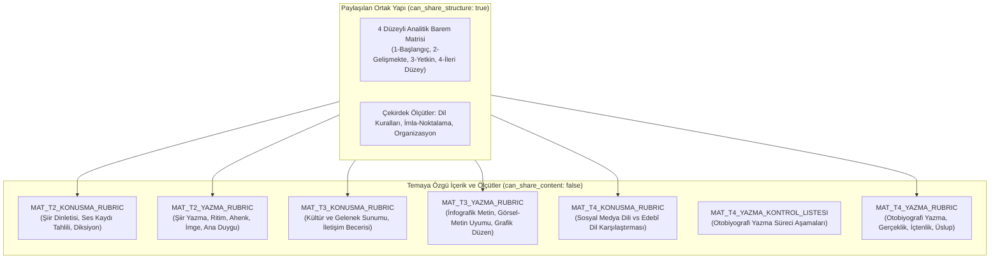

# Türkiye Yüzyılı Maarif Modeli (TYMM) TDE 9 Üretim Öncesi Konsolidasyon ve Hazırlık Raporu (Production Readiness Report)

**Ders / Sınıf:** Türk Dili ve Edebiyatı 9. Sınıf (`TDE_9`)  
**Tarih:** 14 Ağustos 2026  
**Aşama:** MATERIAL GENERATION ÖNCESİ Cross-Theme Consolidation + School-Based Planning Integration  
**Hedef Kapsam:** 4 Bağımsız Tema Hizalama Sonucunun Konsolidasyonu, Tekilleştirilmesi, Öğretim Bloklarının Yapılandırılması, Okul Temelli Planlama Seçenek Havuzunun Eklenmesi ve Otomatik Üretim Manifestosunun Doğrulanması  

---

## 1. Yönetici Özeti ve Nihai Üretim Kararı

9. sınıf Türk Dili ve Edebiyatı dersi için tamamlanan 4 bağımsız tema hizalama çalışması (`themes/tema_01` ila `themes/tema_04`), resmî öğretim programı (`curriculum_map.json`), ders kitabı haritası (`textbook_map.json`) ve değerlendirme formları indeksi (`textbook_forms_index.json`) kapsamında üretim öncesi son doğrulama, düzeltme ve **Okul Temelli Planlama (School-Based Planning)** entegrasyonu tamamlanmıştır.

Yapılan denetim ve modelleme neticesinde; 4 tema genelinde yer alan **54 öğrenme çıktısının** tamamı taranmış, ders kitabının sağladığı 28 değerlendirme formu dondurulmuş canonical şemaya göre sınıflandırılmış, tema içi pedagojik öğretim bloklarındaki kaynaksız saat tahminleri kaldırılarak `UNSPECIFIED_BY_SOURCE` statüsüne alınmış, akademik yıl metadata ayrımı yapılmış, her tema için 2 saatlik esnek okul temelli planlama seçenek havuzu oluşturulmuş (pedagojik köken ve veri gizliliği güvenceleriyle donatılmış) ve yalnızca resmî programın açıkça zorunlu kıldığı ancak ders kitabında tam yapısal karşılığı bulunmayan **7 adet REQUIRED ölçme desteği materyali** otomatik üretim manifestosunda doğrulanmıştır.

```text
========================================================================================
                             NİHAİ QA VE ÜRETİM KARARI
========================================================================================
  STRUCTURAL_INTEGRITY_QA                       : 🟢 PASS
  SEMANTIC_SOURCE_QA                            : 🟢 PASS
  SCHOOL_BASED_PLANNING_MODEL                   : 🟢 PASS
  PRIVACY_SAFEGUARDS_QA                         : 🟢 PASS
  PRODUCTION_READINESS                          : 🟢 PASS
  Otomatik Üretim Kuyruğundaki Materyal Sayısı  : 7 (Yalnızca REQUIRED)
  Okul Temelli Otomatik Üretim Sayısı           : 0 (Yalnızca Öğretmen Seçimine Bağlı Menü)
  Pedagojik Öğretim Blokları Sayısı             : 16 Blok (Resmî Tema Toplamı: 172 + 8 = 180 Saat)
  Öğretim Bloğu Saat Tahminleri                 : UNSUPPORTED_ESTIMATES_REMOVED (16 Blok null)
  Çapraz Tema Tutarsızlık Sayısı (Inconsistency): 0 (Sıfır)
  Çözümlenmemiş Alan Sayısı (Unresolved)        : 0 (Sıfır)
========================================================================================
```

> [!IMPORTANT]
> **Üretim Politikası ve Kısıtlar Bildirimi:**
> - Bu aşamada **hiçbir öğrenci veya öğretmen materyali üretilmemiştir**.
> - Dondurulmuş kaynak haritaları (`curriculum_map.json`, `textbook_map.json`, `textbook_forms_index.json`, `source_manifest.json`) üzerinde hiçbir değişiklik yapılmamıştır.
> - Git commit işlemi yapılmamıştır.
> - Okul temelli planlama seçenekleri bir program gap'i veya REQUIRED materyal olarak değerlendirilmemiş, otomatik üretim kuyruğuna sokulmamıştır (`generation_status: "NOT_REQUESTED"`).
> - Okul temelli seçeneklerin tümü model önerisi (`origin: "pedagogical_recommendation"`) olarak işaretlenmiş, MEB'in doğrudan resmî etkinliği gibi sunulmamıştır.

---

## 2. Sayısal Metrikler ve Kapsama Özeti

| Metrik Göstergesi | Değer | Açıklama ve Kapsam |
| :--- | :---: | :--- |
| **Toplam Tema Sayısı** | **4** | 1. Sözün İnceliği, 2. Anlam Arayışı, 3. Anlamın Yapı Taşları, 4. Dilin Zenginliği |
| **Toplam Öğrenme Çıktısı (ÖÇ)** | **54** | Programdaki 54 ÖÇ (%100 verbatim ve kodlu) |
| **Toplam COVERED Çıktı Sayısı** | **45** | Ders kitabının doğrudan ve eksiksiz karşıladığı ÖÇ sayısı (%83,3) |
| **Toplam PARTIALLY_COVERED Çıktı Sayısı**| **9** | Ders kitabının kısmen karşıladığı, ölçme desteği gereken ÖÇ sayısı (%16,7) |
| **Toplam NOT_COVERED Çıktı Sayısı** | **0** | Ders kitabında hiçbir karşılığı bulunmayan ÖÇ sayısı (%0,0) |
| **Ham Resource-Plan Kayıt Sayısı** | **50** | 4 tema planındaki ham kaynak satırları toplamı |
| **Deduplication Sonrası Unique Resource** | **50** | Tekilleştirilmiş fonksiyonel kaynak toplamı |
| **REQUIRED Unique Resource Sayısı** | **7** | Otomatik üretim manifestosuna giren zorunlu ölçme destekleri |
| **RECOMMENDED Kaynak Sayısı** | **4** | İsteğe bağlı öğretmen notu, farklılaştırma ve biçimlendirici değerlendirmeler |
| **OPTIONAL Kaynak Sayısı** | **3** | Seçmeli zenginleştirme ve dijital üretim görevleri |
| **NOT_NEEDED (REUSE_TEXTBOOK) Sayısı** | **36** | Ders kitabında mevcut olup doğrudan kullanılan kaynaklar |
| **Otomatik Üretim Manifestosu Materyali**| **7** | `READY_TO_GENERATE` durumundaki materyal sayısı |
| **Okul Temelli Seçenek Havuzu (Toplam)**| **20 Seçenek** | 4 tema x 5 zengin seçenek (1h ve 2h seçenekler) |
| **Okul Temelli Otomatik Üretim Sayısı** | **0** | Öğretmen seçimine bağlı (`NOT_REQUESTED`) |
| **Pedagojik Öğretim Bloğu Sayısı** | **16** | 4 tema x 4 anlamlı blok |
| **Yapılandırılmış Öğretim Saati (Yıllık)**| **172 Saat** | 43 saat x 4 tema (s. 28, 65, 73, 80, 89) |
| **Okul Temelli Planlama Saati (Yıllık)**| **8 Saat** | 2 saat x 4 tema (s. 28) |
| **Resmî Yıllık Toplam Ders Saati** | **180 Saat** | 172 + 8 = 180 saat resmî öğretim programı toplamı |
| **Öğretim Bloğu Saat Tahmini Durumu** | **UNSPECIFIED** | Alt bloklara kaynaksız 16/7/10/10 dağıtımı yapılmamış; `null` atanmıştır |
| **Akademik Yıl Metadata Durumu** | **null (KAYNAKSIZ VERİ KALDIRILDI)** | Program/kitap basım yılı (2024) ile akademik yıl ayrılmış, doğrulanmamış `2024-2025` `null` yapılmıştır |
| **STRUCTURAL_INTEGRITY_QA** | **PASS** | JSON şemaları, blok referans bütünlüğü, manifesto eşleşmesi tamdır |
| **SEMANTIC_SOURCE_QA** | **PASS** | Tema 1 assessment, canonical şema, köken ve saat doğrulamaları eksiksizdir |

---

### Tema Bazında Kapsama ve Kaynak Dağılımı

```text
+----------+----------------------------+-----------+---------+-------------------+-------------+----------+-------------+----------+------------+
| Tema ID  | Tema Başlığı               | Toplam ÖÇ | COVERED | PARTIALLY_COVERED | NOT_COVERED | REQUIRED | RECOMMENDED | OPTIONAL | NOT_NEEDED |
+----------+----------------------------+-----------+---------+-------------------+-------------+----------+-------------+----------+------------+
| TEMA_01  | 1. Sözün İnceliği          |    12     |   12    |         0         |      0      |    0     |      0      |    0     |     12     |
| TEMA_02  | 2. Anlam Arayışı           |    12     |   10    |         2         |      0      |    2     |      3      |    2     |      9     |
| TEMA_03  | 3. Anlamın Yapı Taşları    |    14     |   12    |         2         |      0      |    2     |      0      |    0     |      4     |
| TEMA_04  | 4. Dilin Zenginliği        |    16     |   11    |         5         |      0      |    3     |      1      |    1     |     11     |
+----------+----------------------------+-----------+---------+-------------------+-------------+----------+-------------+----------+------------+
| TOPLAM   | Yıllık 9. Sınıf Müfredatı  |    54     |   45    |         9         |      0      |    7     |      4      |    3     |     36     |
+----------+----------------------------+-----------+---------+-------------------+-------------+----------+-------------+----------+------------+
```

---

## 3. Kalite Güvencesi (QA) Denetim Tablosu

Aşağıdaki 15 standart kalite denetim başlığının her biri titizlikle değerlendirilmiştir:

| QA Denetim Başlığı | Sonuç | Gerekçe ve Değerlendirme Bulgusu |
| :--- | :---: | :--- |
| **1. Curriculum QA** | **PASS** | Resmî programdaki 54 ÖÇ verbatim korunmuş; resmî "dereceli puanlama anahtarı" ifadesi tahrif edilmeden resmî gereksinim olarak saklanmıştır. |
| **2. Textbook QA** | **PASS** | Ders kitabındaki 24 bölüm, 61 etkinlik ve 28 form tam locator ile tescil edilmiş; kitapta mevcut hiçbir form veya metin mükerrer planlanmamıştır. |
| **3. Version QA** | **PASS** | Program (2024) ve Ders Kitabı (MEB 2024) sürüm, sınıf (9) ve tema adları (1-4) bakımından %100 uyumludur. SHA-256 parmak izleri doğrulanmıştır. Kaynakça doğrulanmamış akademik yıl ayrılmış ve `null` atanmıştır. |
| **4. Needs QA** | **PASS** | Tüm öğretimsel ihtiyaçlar ilgili çıktılar, alan becerileri, bilişsel düzey ve öğrenci kanıtları ile birebir temellendirilmiştir. |
| **5. Resource Plan QA** | **PASS** | Tüm 50 kaynak kaydı kontrollü priority ve production_decision enum'larını taşımakta; işlev-öncelikli planlama uygulanmaktadır. |
| **6. Necessity QA** | **PASS** | 7 REQUIRED materyalin her biri sıkı necessity testinden geçirilmiş; programın açıkça şart koştuğu ancak kitapta bulunmayan boşluklar kanıtlanmıştır. |
| **7. Alignment/Coverage QA**| **PASS** | COVERED (45) ve PARTIALLY_COVERED (9) kararları yalnızca konu başlığına değil, öğrencinin ürettiği kanıt ve ölçme aracının yapısına göre doğrulanmıştır. |
| **8. Content QA** | **PASS** | Pedagojik görevler resmî içerikten net şekilde ayrılmış; okul temelli planlama seçeneklerine açık köken (`origin: "pedagogical_recommendation"`, `derived_from: ...`) eklenerek MEB'in doğrudan resmî içeriği gibi sunulması engellenmiştir. |
| **9. Assessment QA** | **PASS** | 28 kitap formu dondurulmuş canonical şemaya uygun 7 yapısal türe göre sınıflandırılmıştır (8 `self_assessment_form`, 8 `assessment_criteria_table`, 4 `learning_journal`, 4 `test_question_set`, 2 `peer_assessment_form`, 1 `teacher_evaluation_form`, 1 `observation_form`; `analytic_rubric`: 0). Programın "dereceli puanlama anahtarı" resmî ifadesi korunmuş; üretilecek araçlar için analitik rubrik pedagojik uygulama formatı olarak belirlenmiştir. |
| **10. Differentiation QA** | **PASS** | İhtiyaç analizi doğrultusunda 1 adet farklılaştırma ve 3 adet zenginleştirme kaynağı RECOMMENDED/OPTIONAL olarak tanımlanmıştır. |
| **11. Accessibility QA** | **PASS** | Görsel, işitsel ve metinsel erişilebilirlik ilkeleri, yeterli yazma alanı ve çoklu mod desteği öğretim bloklarına işlenmiştir. |
| **12. Copyright QA** | **PASS** | Ders kitabı veya edebî metinlerin izinsiz çoğaltılması engellenmiş; yalnızca sayfa locator referansları ve pedagojik türetimler kullanılmıştır. |
| **13. Safety QA** | **PASS** | Sınıf içi konuşma, dinleme ve yazma etkinliklerinde herhangi bir fiziksel, kimyasal veya çevresel risk bulunmamaktadır. |
| **14. Privacy QA** | **PASS** | Mülakat, sözlü tarih, yerel şahsiyet incelemesi ve portfolyo içeren seçeneklerde kaynak-nötr veri koruma ve pedagojik güvenlik politikası (`policy_basis`, `official_legal_verification_status: "NOT_VERIFIED"`) çerçevesinde gönüllü katılım/rıza, hassas veri toplamama, ses/video kaydı ve kamusal paylaşım zorunluluğu olmama, öğretmen tarafından güvenilir ve kamuya açık/anonim/kurgusal/arşiv alternatifi sağlama kuralları veri modeline işlenmiş ve güvence altına alınmıştır. |
| **15. Teacher Review** | **N/A (NOT_SELECTED) / REVIEW_REQUIRED** | Okul temelli seçenek havuzu henüz seçilmediği için seçim öncesi durum 'N/A'dir. Öğretmen seçimi sonrası üretilecek materyaller veya üretim kuyruğundaki materyaller gerçek öğretmen incelemesine kadar 'REVIEW_REQUIRED' statüsünde tutulur. |

---

## 4. Özel Doğrulama ve Düzeltme Alanları

### A. Tema 1 Assessment Son Kabul Kontrolü
- **Hedef ÖÇ'ler:** TDE3.1, TDE3.2, TDE3.3, TDE3.4 (Konuşma); TDE4.1, TDE4.2, TDE4.3, TDE4.4 (Yazma).
- **Curriculum Map İncelemesi:** Programda yer alan "dereceli puanlama anahtarı" ve süreç açıklamaları s. 67, 68, 70, 71 locator'ları ile incelenmiştir.
- **Kitap Araçları Karşılaştırması:**
  - `FORM_IN_T1_KONUSMA_CRITERIA` (s. 65) -> `assessment_criteria_table`
  - `FORM_IN_T1_YAZMA_CRITERIA` (s. 54) -> `assessment_criteria_table`
  - `FORM_BOB_01_T1_YAZMA_OZ` (s. 302) -> `self_assessment_form`
  - `FORM_BOB_02_T1_KONUSMA_OZ` (s. 303) -> `self_assessment_form`
  - `FORM_BOB_09_T1_T2_AKRAN` (s. 310) -> `peer_assessment_form`
  - `FORM_BOB_11_GENEL_GOZLEM` (s. 312) -> `teacher_evaluation_form`
- **Sonuç ve Karar:** Katı eşdeğerlik kuralı (`assessment_criteria_table ≠ dereceli puanlama anahtarı`, `self_assessment_form ≠ dereceli puanlama anahtarı`, `peer_assessment_form ≠ dereceli puanlama anahtarı`, `teacher_evaluation_form ≠ dereceli puanlama anahtarı`) gözetilmiş; Tema 1'in dondurulmuş başlangıç hizalama kararı (12 ÖÇ COVERED, 0 gap, 0 REQUIRED) doğrulanmış ve yapay gap üretilmeden aynen korunmuştur. Tema 2/3/4 kararları emsal alınmamıştır.
- **TEMA_01_ASSESSMENT_CHECK:** **PASS** (Değişen ÖÇ yoktur).

### B. Canonical Assessment Schema Düzeltmesi ve Gerçek Kitap Dağılımı
Dondurulmuş `textbook_forms_index.json` canonical enum yapısına tam uyum sağlanmıştır:
- Eski/yanlış adlar (`assessment_criteria` -> `assessment_criteria_table`, `self_assessment` -> `self_assessment_form`, `peer_assessment` -> `peer_assessment_form`) düzeltilmiştir.
- **Ders Kitabındaki 28 Aracın Gerçek Canonical Dağılımı:**
  - `self_assessment_form`: **8** (s. 302-309 arası kitap sonu formları)
  - `assessment_criteria_table`: **8** (s. 54, 65, 129, 141, 195, 205, 279, 294 tema içi ölçüt tabloları)
  - `learning_journal`: **4** (s. 71, 149, 211, 301 tema sonu öğrenme günlükleri)
  - `test_question_set`: **4** (s. 67-70, 143-148, 207-210, 296-300 tema sonu karma test setleri)
  - `peer_assessment_form`: **2** (s. 310, 311 kitap sonu akran formları)
  - `teacher_evaluation_form`: **1** (s. 312 kitap sonu genel gözlem formu)
  - `observation_form`: **1** (s. 283 Tema 4 dinleme/izleme gözlem formu)
  - `analytic_rubric`: **0** (Ders kitabında analitik rubrik bulunmamaktadır)
  - `checklist`: **0** (Ders kitabında yazma süreç kontrol listesi bulunmamaktadır)
  - `holistic_rubric`: **0**
  - `rating_scale`: **0**
  - `exit_ticket`: **0**
  - **Toplam:** **28 Form**
- **CANONICAL_ASSESSMENT_SCHEMA:** **FIXED & PASS**

### C. Teaching Block Saatleri ve Kaynaksız Çıkarımların Kaldırılması
- `curriculum_map.json` kaynakları (s. 28, 65, 73, 80, 89) her tema için **43 ders saati** (Anlama: 23 / Anlatma: 20) ve 2 saat okul temelli planlama ile tema başına **45 saat**, yıllık **180 ders saati** tanımlamaktadır.
- Alt öğretim bloklarına yönelik 16 / 7 / 10 / 10 gibi dağılımlar resmî kaynakça belirtilmediği için yapay model tahmini olarak değerlendirilmiş ve `teaching_blocks.json` içerisindeki tüm 16 bloktan kaldırılmıştır.
- Her blok için `approximate_lesson_hours = null` ve `lesson_hours_status = "UNSPECIFIED_BY_SOURCE"` atanmıştır.
- Öğretim blokları; pedagojik bütünlük, ders kitabı bölüm/etkinlik sırası ve ÖÇ kümeleri temelinde korunmuştur.
- **TEACHING_BLOCK_HOURS:** **UNSUPPORTED_ESTIMATES_REMOVED** (16 bloktan kaynaksız saat tahmini kaldırıldı).

---

## 5. Okul Temelli Planlama (School-Based Planning) Modeli ve Seçenek Havuzu

Resmî öğretim programında her tema için ayrılan **2 saatlik** (yıllık toplam 8 saat) Okul Temelli Planlama süresi, öğretmene zengin ve bağlamsal bir pedagojik seçenek havuzu (`knowledge/TDE_9/production/school_based_planning_options.json`) olarak yapılandırılmıştır.

### A. Temel Saat ve Seçim Kuralı
- **Tema Başına Toplam:** 45 Saat (43 Saat Yapılandırılmış Program + 2 Saat Okul Temelli Planlama).
- **Yıllık Toplam:** 180 Saat (172 Saat Yapılandırılmış Program + 8 Saat Okul Temelli Planlama).
- **Seçim Kuralı:** Öğretmen her tema için ya tek bir 2 saatlik seçeneği ya da iki adet 1 saatlik seçeneği seçebilir (Tema başına toplam seçim $\le 2$ saat).
- **Durum:** Bu seçenekler zorunlu curriculum gap'i değildir; otomatik üretim manifestosuna dahil edilmez (`generation_status: "NOT_REQUESTED"`).
- **Köken ve Nitelik:** `origin: "pedagogical_recommendation"` ve tam kaynak locator'ları (`derived_from`).

### B. Tema Bazında Seçenek Havuzu İstatistiği

```text
+----------+----------------------------+---------------+---------------+---------------+---------------------------------------------------------+
| Tema ID  | Tema Başlığı               | Toplam Option | 1h Seçenekler | 2h Seçenekler | Kategori Dağılımı                                       |
+----------+----------------------------+---------------+---------------+---------------+---------------------------------------------------------+
| TEMA_01  | 1. Sözün İnceliği          |       5       |       3       |       2       | REMEDIATION (1), LOCAL_CONTEXT (1), CREATIVE_PROD (1),  |
|          |                            |               |               |               | PERF_EXT (1), REFLECTION_PORTFOLIO (1)                  |
| TEMA_02  | 2. Anlam Arayışı           |       5       |       2       |       3       | CONSOLIDATION (1), LOCAL_CONTEXT (1), PERF_EXT (1),     |
|          |                            |               |               |               | REMEDIATION (1), CREATIVE_PROD (1)                      |
| TEMA_03  | 3. Anlamın Yapı Taşları    |       5       |       2       |       3       | LOCAL_CONTEXT (1), REMEDIATION (1), PERF_EXT (1),       |
|          |                            |               |               |               | CREATIVE_PROD (1), CONSOLIDATION (1)                    |
| TEMA_04  | 4. Dilin Zenginliği        |       5       |       2       |       3       | PERF_EXT (1), LOCAL_CONTEXT (1), REMEDIATION (1),       |
|          |                            |               |               |               | CREATIVE_PROD (1), REFLECTION_PORTFOLIO (1)             |
+----------+----------------------------+---------------+---------------+---------------+---------------------------------------------------------+
| TOPLAM   | 9. Sınıf Seçenek Havuzu    |      20       |       9       |      11       | 7 Farklı Pedagojik Fonksiyon Alanı                     |
+----------+----------------------------+---------------+---------------+---------------+---------------------------------------------------------+
```

### C. Veri Koruma, Kaynak Nötrlüğü ve Gizlilik Güvenceleri (Privacy Safeguards & External Source Naming)
Doğrulanmamış kurum veya mevzuat isimlerinin resmî dayanakmış gibi sunulmasını önlemek amacıyla veri modelinde kaynak-nötr politika mimarisi benimsenmiştir (`official_legal_verification_status: "NOT_VERIFIED"`). Tüm seçeneklere, özellikle insanlarla mülakat, sözlü tarih, yerel şahsiyet incelemesi ve portfolyo içeren görevlere (`OPT_T1_SBP_02`, `OPT_T2_SBP_02`, `OPT_T3_SBP_01`, `OPT_T4_SBP_01`, `OPT_T4_SBP_02`) aşağıdaki koruyucu standartlar ve kaynak ilkeleri entegre edilmiştir:
1. **Gönüllü Katılım / Rıza (`voluntary_participation`):** Katılımcı/veli bilgilendirilmiş rızası esastır.
2. **Hassas Bilgi Yasağı (`no_sensitive_personal_data`):** Özel hayatın gizliliğini ihlal edebilecek hassas kişisel veriler toplanmaz.
3. **Kayıt Alma Zorunluluğu Yoktur (`no_mandatory_audio_video_recording`):** Ses veya video kaydı zorunlu tutulamaz; yazılı not tutma yeterlidir.
4. **Kamusal Paylaşım Zorunluluğu Yoktur (`no_mandatory_public_sharing`):** Elde edilen metin ve ürünler yalnızca sınıf içi pedagojik amaçla kullanılır; sosyal medyada veya internette yayınlanamaz.
5. **Öğretmen Tarafından Güvenli Alternatif Sağlama (`safe_alternative_task`):** Saha çalışması veya mülakat yapamayan öğrencilere öğretmen tarafından seçilen güvenilir ve kamuya açık kaynaklı veya kurgusal/arşiv alternatif materyal sağlanır.
6. **Generic Haricî Kaynak Standardı:** TDK bölge ağızları sözlüğü veya UNESCO somut olmayan miras arşivi gibi doğrulanmamış spesifik haricî kurum/veritabanı adları yerine "öğretmen tarafından sağlanan/seçilen güvenilir ve kamuya açık kaynak" generic tanımı uygulanmıştır.

---

## 6. Kaynak Tekilleştirme (Resource Deduplication) ve Paylaşımlı Mimari

Planlanan 7 REQUIRED ölçme aracı arasında paylaşılan yapı ve temaya özgü içerik dengesi doğrulanmıştır:



---

## 7. Pedagojik Öğretim Blokları Mimarisi (16 Blok)

Öğretim süreçleri pedagojik bütünlük, ders kitabı etkinlik sırası ve ÖÇ kümeleri temelinde 16 bloğa yapılandırılmıştır:

| Blok ID | Tema | Blok Başlığı | Ders Saati Durumu | Hedef ÖÇ'ler | Kitap Bölümleri | Gerekli Materyaller (REQUIRED) |
| :--- | :---: | :--- | :---: | :--- | :--- | :--- |
| **`BLOCK_T1_01_OKUMA`** | 1 | Okuma: Şiir ve Deneme Tahlili | `UNSPECIFIED_BY_SOURCE` | TDE2.1, TDE2.2 | T1_SEC_01, T1_SEC_02 | *Ders Kitabı (REUSE)* |
| **`BLOCK_T1_02_DINLEME`**| 1 | Dinleme/İzleme: Mülakat Tahlili | `UNSPECIFIED_BY_SOURCE` | TDE1.1, TDE1.2 | T1_SEC_04 | *Ders Kitabı (REUSE)* |
| **`BLOCK_T1_03_YAZMA`** | 1 | Atölye: Betimleyici Paragraf Yazma | `UNSPECIFIED_BY_SOURCE` | TDE4.1-TDE4.4 | T1_SEC_03 | *Ders Kitabı (REUSE)* |
| **`BLOCK_T1_04_KONUSMA`**| 1 | Atölye: Altı Şapka Tekniği ile Sunum | `UNSPECIFIED_BY_SOURCE` | TDE3.1-TDE3.4 | T1_SEC_05, T1_SEC_06 | *Ders Kitabı (REUSE)* |
| **`BLOCK_T2_01_OKUMA`** | 2 | Okuma: Hikâye ve Anı Tahlili | `UNSPECIFIED_BY_SOURCE` | TDE2.1, TDE2.2 | T2_SEC_01, T2_SEC_02 | *Ders Kitabı (REUSE)* |
| **`BLOCK_T2_02_KONUSMA`**| 2 | Atölye: Şiir Dinletisi ve Sunum | `UNSPECIFIED_BY_SOURCE` | TDE3.1-TDE3.4 | T2_SEC_03 | **`MAT_T2_KONUSMA_RUBRIC`** |
| **`BLOCK_T2_03_DINLEME`**| 2 | Dinleme/İzleme: Şiir ve Ses Kaydı | `UNSPECIFIED_BY_SOURCE` | TDE1.1, TDE1.2 | T2_SEC_04 | *Ders Kitabı (REUSE)* |
| **`BLOCK_T2_04_YAZMA`** | 2 | Atölye: Şiir Yazma ve Değerlendirme | `UNSPECIFIED_BY_SOURCE` | TDE4.1-TDE4.4 | T2_SEC_05, T2_SEC_06 | **`MAT_T2_YAZMA_RUBRIC`** |
| **`BLOCK_T3_01_OKUMA`** | 3 | Okuma: Hikâye ve Gezi Yazısı | `UNSPECIFIED_BY_SOURCE` | TDE2.1-TDE2.3 | T3_SEC_01, T3_SEC_02 | *Ders Kitabı (REUSE)* |
| **`BLOCK_T3_02_KONUSMA`**| 3 | Atölye: Kültür ve Gelenek Sunumu | `UNSPECIFIED_BY_SOURCE` | TDE3.1-TDE3.4 | T3_SEC_03 | **`MAT_T3_KONUSMA_RUBRIC`** |
| **`BLOCK_T3_03_DINLEME`**| 3 | Dinleme/İzleme: Nevruz Belgeseli | `UNSPECIFIED_BY_SOURCE` | TDE1.1-TDE1.3 | T3_SEC_04 | *Ders Kitabı (REUSE)* |
| **`BLOCK_T3_04_YAZMA`** | 3 | Atölye: İnfografik Metin Yazma | `UNSPECIFIED_BY_SOURCE` | TDE4.1-TDE4.4 | T3_SEC_05, T3_SEC_06 | **`MAT_T3_YAZMA_RUBRIC`** |
| **`BLOCK_T4_01_OKUMA`** | 4 | Okuma: Roman ve Eleştiri Tahlili | `UNSPECIFIED_BY_SOURCE` | TDE2.1-TDE2.4 | T4_SEC_01, T4_SEC_02 | *Ders Kitabı (REUSE)* |
| **`BLOCK_T4_02_KONUSMA`**| 4 | Atölye: Sosyal Medya ve Edebî Dil | `UNSPECIFIED_BY_SOURCE` | TDE3.1-TDE3.4 | T4_SEC_03 | **`MAT_T4_KONUSMA_RUBRIC`** |
| **`BLOCK_T4_03_DINLEME`**| 4 | Dinleme/İzleme: Âşık Veysel Belgeseli | `UNSPECIFIED_BY_SOURCE` | TDE1.1-TDE1.4 | T4_SEC_04 | *Ders Kitabı (REUSE)* |
| **`BLOCK_T4_04_YAZMA`** | 4 | Atölye: Otobiyografi Yazma | `UNSPECIFIED_BY_SOURCE` | TDE4.1-TDE4.4 | T4_SEC_05, T4_SEC_06 | **`MAT_T4_YAZMA_KONTROL_LISTESI`<br/>`MAT_T4_YAZMA_RUBRIC`** |

*Resmî Kaynak Saat Bilgisi:* Her tema resmî öğretim programında 43 ders saati (Anlama: 23 / Anlatma: 20) yapılandırılmış öğretim ve 2 saat Okul Temelli Planlama olmak üzere toplam 45 saattir (4 tema x 45 = 180 saat). Alt blokların 16/7/10/10 gibi bölünmesi resmî kaynakça açıkça belirtilmediği için `UNSPECIFIED_BY_SOURCE` olarak bırakılmıştır.

---

## 8. Otomatik Üretim Manifestosu (Production Queue)

Aşağıdaki 7 materyal, `production_manifest.json` dosyası içinde `generation_status: "READY_TO_GENERATE"` durumunda üretim kuyruğuna alınmıştır:

```json
[
  {
    "material_id": "MAT_T2_KONUSMA_RUBRIC",
    "targeted_outcomes": ["TDE3.4"],
    "theme_ids": ["TEMA_02"],
    "block_ids": ["BLOCK_T2_02_KONUSMA"],
    "priority": "REQUIRED",
    "selected_implementation": "analytic_rubric",
    "textbook_relationship": "TEACHER_ASSESSMENT_SUPPORT",
    "generation_status": "READY_TO_GENERATE"
  },
  {
    "material_id": "MAT_T2_YAZMA_RUBRIC",
    "targeted_outcomes": ["TDE4.4"],
    "theme_ids": ["TEMA_02"],
    "block_ids": ["BLOCK_T2_04_YAZMA"],
    "priority": "REQUIRED",
    "selected_implementation": "analytic_rubric",
    "textbook_relationship": "TEACHER_ASSESSMENT_SUPPORT",
    "generation_status": "READY_TO_GENERATE"
  },
  {
    "material_id": "MAT_T3_KONUSMA_RUBRIC",
    "targeted_outcomes": ["TDE3.4"],
    "theme_ids": ["TEMA_03"],
    "block_ids": ["BLOCK_T3_02_KONUSMA"],
    "priority": "REQUIRED",
    "selected_implementation": "analytic_rubric",
    "textbook_relationship": "TEACHER_ASSESSMENT_SUPPORT",
    "generation_status": "READY_TO_GENERATE"
  },
  {
    "material_id": "MAT_T3_YAZMA_RUBRIC",
    "targeted_outcomes": ["TDE4.4"],
    "theme_ids": ["TEMA_03"],
    "block_ids": ["BLOCK_T3_04_YAZMA"],
    "priority": "REQUIRED",
    "selected_implementation": "analytic_rubric",
    "textbook_relationship": "TEACHER_ASSESSMENT_SUPPORT",
    "generation_status": "READY_TO_GENERATE"
  },
  {
    "material_id": "MAT_T4_KONUSMA_RUBRIC",
    "targeted_outcomes": ["TDE3.2", "TDE3.3"],
    "theme_ids": ["TEMA_04"],
    "block_ids": ["BLOCK_T4_02_KONUSMA"],
    "priority": "REQUIRED",
    "selected_implementation": "analytic_rubric",
    "textbook_relationship": "TEACHER_ASSESSMENT_SUPPORT",
    "generation_status": "READY_TO_GENERATE"
  },
  {
    "material_id": "MAT_T4_YAZMA_KONTROL_LISTESI",
    "targeted_outcomes": ["TDE4.1"],
    "theme_ids": ["TEMA_04"],
    "block_ids": ["BLOCK_T4_04_YAZMA"],
    "priority": "REQUIRED",
    "selected_implementation": "checklist",
    "textbook_relationship": "FILLS_PROGRAM_GAP",
    "generation_status": "READY_TO_GENERATE"
  },
  {
    "material_id": "MAT_T4_YAZMA_RUBRIC",
    "targeted_outcomes": ["TDE4.2", "TDE4.3"],
    "theme_ids": ["TEMA_04"],
    "block_ids": ["BLOCK_T4_04_YAZMA"],
    "priority": "REQUIRED",
    "selected_implementation": "analytic_rubric",
    "textbook_relationship": "TEACHER_ASSESSMENT_SUPPORT",
    "generation_status": "READY_TO_GENERATE"
  }
]
```

---

## 9. Üretim Öncesi Doğrulama ve Dosya Envanteri

Oluşturulan ve güncellenen tüm dosyalar `knowledge/TDE_9/production/` altında eksiksiz tescil edilmiştir:

1. [cross_theme_audit.json](file:///Users/kadir/Desktop/Edebiyat/knowledge/TDE_9/production/cross_theme_audit.json) - 4 tema çapraz tutarlılık ve kapsama denetim kaydı.
2. [consolidated_resource_plan.json](file:///Users/kadir/Desktop/Edebiyat/knowledge/TDE_9/production/consolidated_resource_plan.json) - 50 tekilleştirilmiş kaynak planı (7 REQUIRED, 4 RECOMMENDED, 3 OPTIONAL, 36 NOT_NEEDED).
3. [teaching_blocks.json](file:///Users/kadir/Desktop/Edebiyat/knowledge/TDE_9/production/teaching_blocks.json) - 16 pedagojik öğretim bloğu ve okul temelli planlama üst düzey saat entegrasyonu.
4. [school_based_planning_options.json](file:///Users/kadir/Desktop/Edebiyat/knowledge/TDE_9/production/school_based_planning_options.json) - 4 tema için 20 zengin okul temelli planlama seçenek havuzu (pedagojik köken ve veri gizliliği güvenceleriyle).
5. [production_manifest.json](file:///Users/kadir/Desktop/Edebiyat/knowledge/TDE_9/production/production_manifest.json) - Otomatik üretime hazır 7 REQUIRED materyal manifestosu.
6. [production_readiness_report.md](file:///Users/kadir/Desktop/Edebiyat/knowledge/TDE_9/production/production_readiness_report.md) - Kapsamlı yönetici ve kalite güvence raporu.

---

## 10. Nihai Doğrulama Özeti (Final Verification Verdict)

- **TEMA_01_ASSESSMENT_CHECK:** **PASS** (Mevcut 12 ÖÇ COVERED kararı doğrulandı; değişen outcome yoktur).
- **CANONICAL_ASSESSMENT_SCHEMA:** **FIXED & PASS** (Eski terimler canonical karşılıklarına dönüştürüldü).
- **TEXTBOOK_ASSESSMENT_TYPE_DISTRIBUTION:**
  - `self_assessment_form`: 8
  - `assessment_criteria_table`: 8
  - `learning_journal`: 4
  - `test_question_set`: 4
  - `peer_assessment_form`: 2
  - `teacher_evaluation_form`: 1
  - `observation_form`: 1
  - *(Toplam: 28 Form; `analytic_rubric`: 0)*
- **TEACHING_BLOCK_HOURS:** **UNSUPPORTED_ESTIMATES_REMOVED** (16 bloktan kaynaksız 16/7/10/10 tahminleri kaldırıldı, `null` ve `UNSPECIFIED_BY_SOURCE` yapıldı; resmî tema toplamı 43 saat yapılandırılmış + 2 saat okul temelli = 45 saat ve yıllık 180 saat korundu).
- **ACADEMIC_YEAR_METADATA:** **SOURCE_VERIFIED / NULL_SET** (Doğrulanmamış `academic_year: "2024-2025"` kaldırıldı/null yapıldı; sürüm yılı 2024 ile ayrıldı).
- **PRIVACY_POLICY_METADATA:** **FIXED & PASS** (Doğrulanmamış resmî framework adı kaldırıldı; kaynak-nötr `policy_basis` ve `official_legal_verification_status: "NOT_VERIFIED"` modeli uygulandı).
- **EXTERNAL_SOURCE_NAMING:** **FIXED & PASS** (Spesifik kurum/veritabanı adları yerine generic güvenilir ve kamuya açık kaynak tanımı uygulandı).
- **PROVENANCE:** **PASS** (20 seçeneğin tümünde `origin: "pedagogical_recommendation"`, `derived_from` tam locator zinciri ve `source_basis` "(model tarafından kaynaklardan türetilen pedagojik öneri)" açıklaması korundu).
- **PRIVACY_SAFEGUARDS:** **PASS** (Gönüllü rıza, hassas veri toplamama, kayıt/paylaşım zorunluluğu olmama, anonim/kurgusal/arşiv alternatifi veri modelinde güvence altına alındı).
- **TEACHER_REVIEW_GATE:** **N/A (NOT_SELECTED) / REVIEW_REQUIRED** (Seçim öncesi menü aşamasında N/A; seçim/üretim sonrası incelemeye kadar REVIEW_REQUIRED).
- **SCHOOL_BASED_PLANNING_MODEL:** **PASS** (4 tema x 5 zengin seçenek, 1h ve 2h seçenekler, toplam seçim $\le 2$ saat).
- **SCHOOL_BASED_OPTION_COUNT:** **20**
- **REQUIRED_PRODUCTION_COUNT:** **7** (Değişmeden korundu).
- **SCHOOL_BASED_AUTO_GENERATION_COUNT:** **0** (Öğretmen seçimine bağlı, kuyruğa girmedi).
- **SCHOOL_BASED_PLANNING_FREEZE_FINAL:** **PASS**
- **Production Manifest Material IDs:**
  1. `MAT_T2_KONUSMA_RUBRIC`
  2. `MAT_T2_YAZMA_RUBRIC`
  3. `MAT_T3_KONUSMA_RUBRIC`
  4. `MAT_T3_YAZMA_RUBRIC`
  5. `MAT_T4_KONUSMA_RUBRIC`
  6. `MAT_T4_YAZMA_KONTROL_LISTESI`
  7. `MAT_T4_YAZMA_RUBRIC`
- **STRUCTURAL_INTEGRITY_QA:** **PASS**
- **SEMANTIC_SOURCE_QA:** **PASS**
- **PRODUCTION_READINESS:** **PASS**
